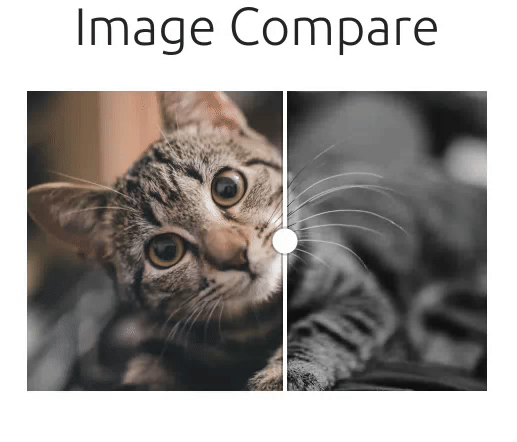
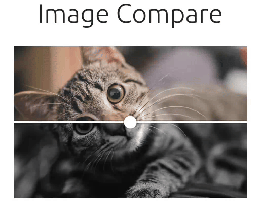
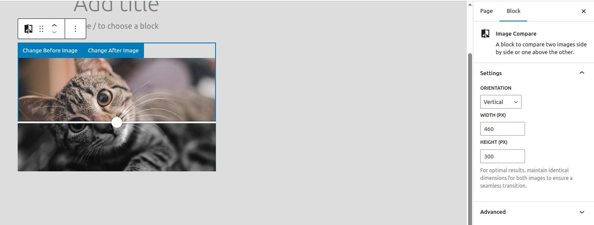

# Image Compare

**Contributors**: Maryory Arrieta  
**Tags**: block  
**Tested up to**: 6.7  
**Stable tag**: 0.1.0  
**License**: GPL-2.0-or-later  
**License URI**: [https://www.gnu.org/licenses/gpl-2.0.html](https://www.gnu.org/licenses/gpl-2.0.html)  
**GitHub**: [arrimc](https://github.com/arrimc)  

---

## Description  

**Image Compare** is a WordPress block that allows you to showcase two images with a draggable slider. Perfect for highlighting before/after comparisons or product transformations.  

## Key Features  

- **Slider Comparison**: Smoothly reveal between two images with a user-friendly slider.  
- **Dual Orientations**: Choose between **horizontal** (left/right) or **vertical** (up/down) sliding effects.  
- **Customizable Dimensions**: Control the `width` and `height` of the block to fit your layout.  
- **Simple Setup**: Add images, adjust settings, and publish—no coding required.  

Ideal for photographers, designers, e-commerce sites, or anyone needing visual A/B comparisons.  

---

## Preview

### Horizontal Slider

### Vertical Slider

### Editor View

---

## Installation  

1. Upload `/image-compare` to the `/wp-content/plugins/` directory, **or** install via **Plugins → Add New** in WordPress.  
2. Activate **Image Compare** in your plugins list.  
3. Add the block via the Block Editor (search for "Image Compare").  

---

### Additional Notes  
- For support or contributions, visit the [GitHub repository](https://github.com/arrimc).  
- Compatible with WordPress 6.0+ and full site editing (FSE).  
